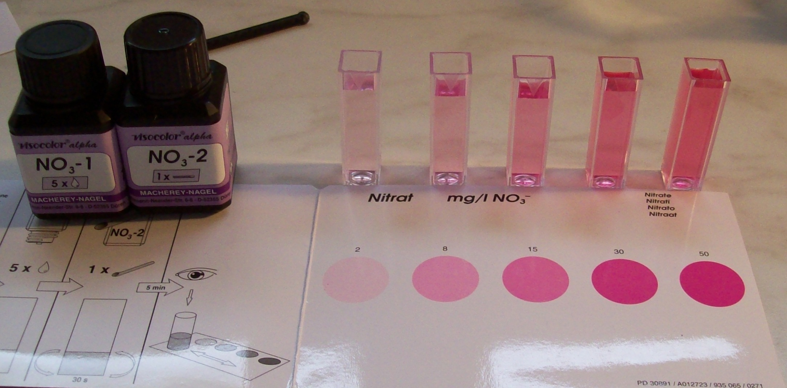
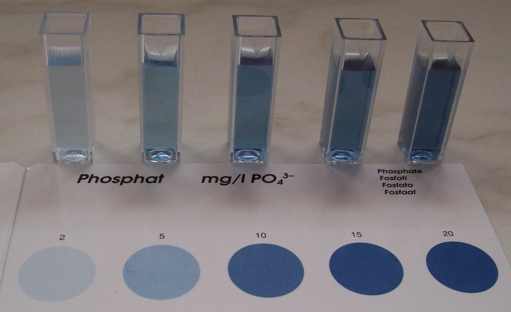

# 📏 Pierron Colorimeter Extension: Low-Cost Photometer for Nitrates (NO₃⁻) and Phosphates (PO₄³⁻)

This module explains how to reuse a basic Pierron colorimeter (originally designed for turbidity) as a **low-cost photometer** for nitrate and phosphate measurements.

## 🎨 1️⃣ Use of a Proper Complementary Color Filter

For best measurement accuracy:

- **Phosphates:** The reaction produces a **blue solution** (molybdate blue complex). This means it strongly absorbs **red/orange light**. Therefore, use a **red or orange filter** to isolate this part of the spectrum.
  
- **Nitrates:** The reaction typically produces a **pink solution** (Griess reaction). This means it strongly absorbs **green light**. Therefore, use a **green filter** to select this wavelength band.
  
✅ A simple piece of theater gel filter or colored plastic sheet is sufficient. This avoids expensive laboratory filters.

## 🧪 2️⃣ Prepare a Homemade Calibration Series

To save on costly test kits:

1️⃣ Buy a simple liquid garden fertilizer containing both nitrogen (N) and phosphorus (P).  
2️⃣ Prepare a dilution series in demineralized water: e.g., 5 ppm, 10 ppm, 20 ppm, 50 ppm.  
3️⃣ Add the standard reagent drops according to the color test instructions (Macherey-Nagel, Visocolor, or equivalent).  
4️⃣ Measure each dilution with the Pierron device and record the raw light level or voltage.  
5️⃣ Plot your calibration curve once: use it to read unknown samples in the future.

## 📷 Example Images

Below are sample calibration setups:

## ✅ 3️⃣ Good Practice

- This method does not replace lab-grade spectrophotometry but provides robust semi-quantitative data for field, education, or citizen science.

- Clean your cuvettes and store the filter piece safely for reuse.

- Combine nitrate and phosphate readings with turbidity measurements for a complete low-cost water quality toolkit.

## 🗂️ Files & Calibration

- **How to calibrate:**
  
  Once you record your raw signal or voltage for each dilution point, you can build your calibration curve in several ways:
  
  ✅ Use a simple spreadsheet (Excel, OpenOffice Calc) to fit a linear or polynomial trendline and get the equation.  
  ✅ Use a short Python script (NumPy, SciPy, Matplotlib) for flexible fitting and plotting.  
  ✅ Or simply ask a modern LLM (GPT, Grok, Mistral, Copilot) to generate the fitting code or directly interpret your data!

**Tip:** Store your calibration results in this JSON or a simple CSV file for reuse and comparison.

## 🔑 Key Insight

**A properly chosen complementary color filter + a simple homemade dilution curve transforms a basic colorimeter into a multipurpose low-cost photometer for NO₃⁻ and PO₄³⁻.**

---

**Lyra Project — Open Science, Low-Cost Field Methods.**  
2025 © Jérôme
