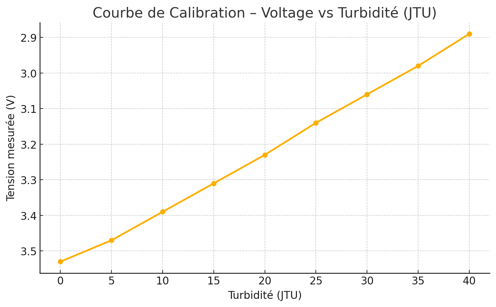
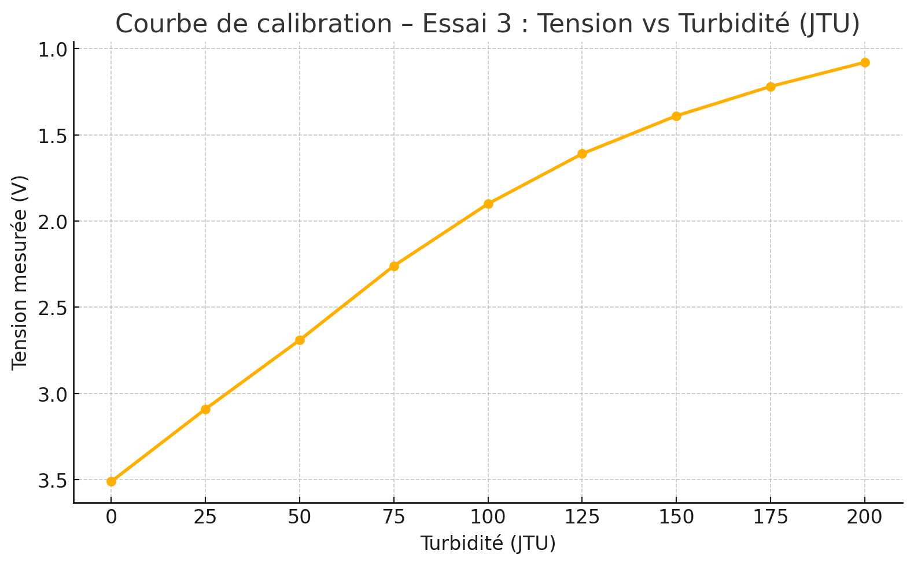
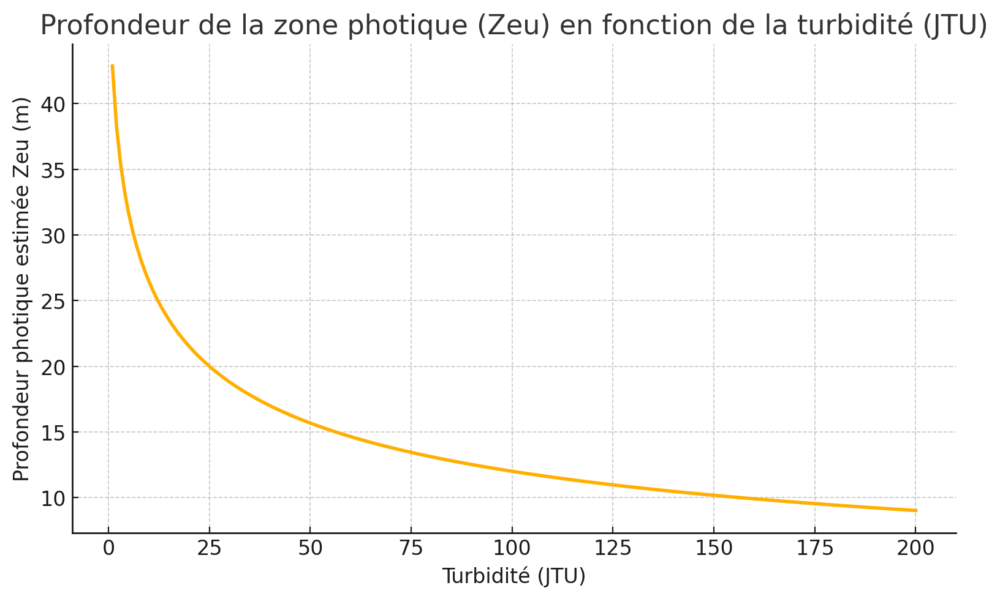

# Turbidity Sensor Calibration –Pierron Colorimeter

This project documents the calibration of a modified Pierron colorimeter for measuring water turbidity in natural environments, using a low-cost analog sensor read via Arduino.

## 🔬 Physical Principle: Beer–Lambert Law

The sensor's optical response is based on the **Beer–Lambert law**, which relates the attenuation of light to the properties of the medium. In theory, transmitted light decreases logarithmically with increasing turbidity. However, within the range 0–100 JTU, the system's response was found to be almost perfectly linear, justifying the use of a linear calibration model for practical and computational simplicity.

## ⚙️ Sensor Characteristics

- **Output voltage range:** ~3.5 V (clear water) to ~1.0 V (high turbidity)
- **Sensor type:** Pierron optical colorimeter (modified)
- **Light source:** Internal lamp (halogen or LED)
- **Detection range:** 0 – 200 JTU
- **Precision zone:** 0 – 100 JTU (validated)

## 🧪 Calibration Methodology

### 1. 🥛 Milk as Scattering Agent
- A 50 mL water sample was used in a cuvette.
- Drops of skimmed milk were added gradually:
  - **Test 1–3:** increments of 5 drops (~25 JTU per step)
  - **Test 4:** increments of 1 drop (~5 JTU per step)
- Voltage was measured with a digital multimeter after each addition.

### 2. 📏 Calibration with Lamotte Kit (Visual Standard)
- A Lamotte turbidity test kit was used to **visually correlate** milk additions to JTU units.
- Comparison was made between:
  - The disappearance of the black circle in the Lamotte tube
  - The amount of milk producing a similar optical effect
- Conclusion:
  - **1 drop of milk in 25 mL ≈ 10 JTU**
  - Therefore, **1 drop in 50 mL ≈ 5 JTU**

### 3. 🧪 Sensitivity Tests
- Independent tests with 1 drop of milk in 100 mL of pure water showed voltage variations of **0.03–0.04 V**.
- This supports a **fine detection threshold of ~0.25 JTU**, especially in controlled conditions (light-shielded cuvette).

### 4. ⚖️ Model Selection
- Data showed **excellent linearity** up to 100 JTU.
- The **linear model** was preferred for both accuracy and **ease of implementation**.


*Figure – Test 4: fine resolution with 5 JTU steps, used to validate linearity in the sensitive range.*

## 📈 Calibration Model

After comparison with logarithmic and polynomial models, a **linear calibration** was selected:

```
V = -0.0165 × JTU + 3.53
⇒ JTU = (3.53 – V) / 0.0165
```

This model fits:
- **Test 4** (0 to 40 JTU, 5 JTU steps)
- **Test 3** (0 to 100 JTU, 25 JTU steps)


ℹ️ The linear fit across the 0–100 JTU range yielded an R² of 0.9993, confirming excellent agreement between the model and empirical data. 



*Figure – Test 3: coarse steps (25 JTU) confirm consistency of linear model up to 100 JTU.*

## ✅ Justification

| JTU Range      | Usage                    | Comment |
|----------------|--------------------------|---------|
| 0 – 100 JTU    | ✅ **Standard range**     | High precision, resolution ~0.25 JTU |
| 100 – 125 JTU  | ⚠️ **Extended use**       | Slight linearity loss |
| >125 JTU       | ❌ **Not recommended**    | Optical floor, reduced sensitivity |

- **Practical resolution**: ~0.03–0.04 V per 5 JTU
- **Sensor response**: stable and reproducible


💡 If turbidity exceeds 125 JTU, simply dilute the sample (1:1 with distilled, or demineralized water), measure the mixed solution, and multiply the result by 2 to recover the original value. This extends the range up to ~250 JTU without modifying the sensor or code.

## 🌞 Optional Use: Photic Zone Estimation

### 🌊 Typical Turbidity Values in Natural Waters

- **Clear alpine lake:** 1–5 JTU
- **Temperate mesotrophic lake:** 10–30 JTU
- **River after heavy rainfall:** 100–200 JTU

The **photic zone** is the depth at which sunlight penetration supports photosynthesis. It is a critical parameter for aquatic ecosystems, influencing biological productivity, algal growth, and oxygenation. Its depth generally varies with turbidity, suspended solids, plankton density, colored dissolved organic matter (CDOM), and incident sunlight angle and intensity.

You can estimate **photic depth (Zeu)** using:

```
k = 0.05 + 0.02 × √JTU
Zeu = 3 / k
```

For example:
- 25 JTU → Zeu ≈ 3.6 m
- 50 JTU → Zeu ≈ 2.5 m
- 75 JTU → Zeu ≈ 2.0 m


*Figure – Estimated photic depth (Zeu) versus turbidity (JTU), using empirical formula.*

*This empirical model was inspired by limnological observations published in the* Canadian Journal of Fisheries and Aquatic Sciences *and* Hydrobiologia.


### 🧪 Use Cases
The Python scripts provide a low-cost, open-source method for estimating water turbidity (in JTU) and photic zone depth (Zeu, in meters) from a simple voltage measurement.
It can be used in several environments:

✅ Full version on PC or JupyterLab: includes calculation and light attenuation graph.

✅ Mobile version on smartphone (via apps like Pydroid3 or QPython): real-time field calculation, optionally with graphical output.

✅ Minimal version on Python calculators (e.g., TI-82 Python Edition): numerical-only output, fully offline and autonomous.

This approach is designed for fieldwork, low-tech education, citizen science, and any context where simplicity, transparency, and reproducibility are key.


## 📁 Included Files

### `/calibration`
- `calibration_data.txt` – raw measurement values

### `/curves`
- `test_3.png` – voltage vs JTU (Test 3)
- `test_4.png` – voltage vs JTU (Test 4)
- `Z_photique_vs_JTU.png` – photic depth vs turbidity
- `python script result` (JupyterLab)

### `/code`
- `Calc_turbidity.txt`
- `Calc_tubidity_simplified.txt`


### `/pictures`
- `Lamotte_turbidity_kit.jpg`
- `colorimeter_1.jpg`
- `colorimeter_2.jpg`

## 📚 References

- Canadian Journal of Fisheries and Aquatic Sciences  
- Hydrobiologia  
- Kirk, J. T. O. (1994). *Light and Photosynthesis in Aquatic Ecosystems*. Cambridge University Press.  
- Wetzel, R. G. (2001). *Limnology: Lake and River Ecosystems*. Academic Press.

## 👨‍🔬 Author

This project was conducted by **Jérôme**, as part of an open-science initiative to develop practical and educational environmental sensing tools.

🔗 **See also my related work on GitHub**:
- [Main GitHub profile](https://github.com/Jerome-openclassroom)
