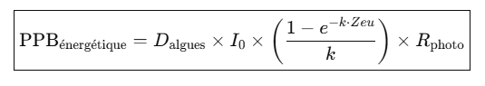
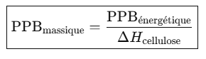
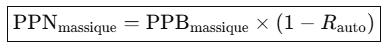

# Turbidity Sensor Calibration –Pierron Colorimeter

This project documents the calibration of a modified Pierron colorimeter for measuring water turbidity in natural environments, using a low-cost analog sensor read via Arduino.

## 🔬 Physical Principle: Beer–Lambert Law

The sensor's optical response is based on the **Beer–Lambert law**, which relates the attenuation of light to the properties of the medium. In theory, transmitted light decreases logarithmically with increasing turbidity. However, within the range 0–100 JTU, the system's response was found to be almost perfectly linear, justifying the use of a linear calibration model for practical and computational simplicity.

## ⚙️ Sensor Characteristics

- **Output voltage range:** ~3.5 V (clear water) to ~1.0 V (high turbidity)
- **Sensor type:** Pierron optical colorimeter (modified)
- **Light source:** Internal lamp (halogen or LED)
- **Detection range:** 0 – 200 JTU
- **Precision zone:** 0 – 100 JTU (validated)

## 🧪 Calibration Methodology

### 1. 🥛 Milk as Scattering Agent
- A 50 mL water sample was used in a cuvette.
- Drops of skimmed milk were added gradually:
  - **Test 1–3:** increments of 5 drops (~25 JTU per step)
  - **Test 4:** increments of 1 drop (~5 JTU per step)
- Voltage was measured with a digital multimeter after each addition.

### 2. 📏 Calibration with Lamotte Kit (Visual Standard)
- A Lamotte turbidity test kit was used to **visually correlate** milk additions to JTU units.
- Comparison was made between:
  - The disappearance of the black circle in the Lamotte tube
  - The amount of milk producing a similar optical effect
- Conclusion:
  - **1 drop of milk in 25 mL ≈ 10 JTU**
  - Therefore, **1 drop in 50 mL ≈ 5 JTU**

### 3. 🧪 Sensitivity Tests
- Independent tests with 1 drop of milk in 100 mL of pure water showed voltage variations of **0.03–0.04 V**.
- This supports a **fine detection threshold of ~0.25 JTU**, especially in controlled conditions (light-shielded cuvette).

### 4. ⚖️ Model Selection
- Data showed **excellent linearity** up to 100 JTU.
- The **linear model** was preferred for both accuracy and **ease of implementation**.


*Figure – Test 4: fine resolution with 5 JTU steps, used to validate linearity in the sensitive range.*

## 📈 Calibration Model

After comparison with logarithmic and polynomial models, a **linear calibration** was selected:

```
V = -0.0165 × JTU + 3.53
⇒ JTU = (3.53 – V) / 0.0165
```

This model fits:
- **Test 4** (0 to 40 JTU, 5 JTU steps)
- **Test 3** (0 to 100 JTU, 25 JTU steps)


ℹ️ The linear fit across the 0–100 JTU range yielded an R² of 0.9993, confirming excellent agreement between the model and empirical data. 


*Figure – Test 3: coarse steps (25 JTU) confirm consistency of linear model up to 100 JTU.*

## ✅ Justification

| JTU Range      | Usage                    | Comment |
|----------------|--------------------------|---------|
| 0 – 100 JTU    | ✅ **Standard range**     | High precision, resolution ~0.25 JTU |
| 100 – 125 JTU  | ⚠️ **Extended use**       | Slight linearity loss |
| >125 JTU       | ❌ **Not recommended**    | Optical floor, reduced sensitivity |

- **Practical resolution**: ~0.03–0.04 V per 5 JTU
- **Sensor response**: stable and reproducible


💡 If turbidity exceeds 125 JTU, simply dilute the sample (1:1 with distilled, or demineralized water), measure the mixed solution, and multiply the result by 2 to recover the original value. This extends the range up to ~250 JTU without modifying the sensor or code.

## 🌞 Optional Use: Photic Zone Estimation

### 🌊 Typical Turbidity Values in Natural Waters

- **Clear alpine lake:** 1–5 JTU
- **Temperate mesotrophic lake:** 10–30 JTU
- **River after heavy rainfall:** 100–200 JTU

The **photic zone** is the depth at which sunlight penetration supports photosynthesis. It is a critical parameter for aquatic ecosystems, influencing biological productivity, algal growth, and oxygenation. Its depth generally varies with turbidity, suspended solids, plankton density, colored dissolved organic matter (CDOM), and incident sunlight angle and intensity.

You can estimate **photic depth (Zeu)** using:

```
k = 0.05 + 0.02 × √JTU
Zeu = 3 / k
```

For example:
- 25 JTU → Zeu ≈ 3.6 m
- 50 JTU → Zeu ≈ 2.5 m
- 75 JTU → Zeu ≈ 2.0 m


*Figure – Estimated photic depth (Zeu) versus turbidity (JTU), using empirical formula.*

*This empirical model was inspired by limnological observations published in the* Canadian Journal of Fisheries and Aquatic Sciences *and* Hydrobiologia.


### 🧪 Use Cases
The Python scripts provide a low-cost, open-source method for estimating water turbidity (in JTU) and photic zone depth (Zeu, in meters) from a simple voltage measurement.
It can be used in several environments:

✅ Full version on PC or JupyterLab: includes calculation and light attenuation graph.

✅ Mobile version on smartphone (via apps like Pydroid3 or QPython): real-time field calculation, optionally with graphical output.

✅ Minimal version on Python calculators (e.g., TI-82 Python Edition): numerical-only output, fully offline and autonomous.

This approach is designed for fieldwork, low-tech education, citizen science, and any context where simplicity, transparency, and reproducibility are key.

**********************

## 🌿 Model Extension: Estimating Aquatic Primary Productivity

📌 Note on Model Origin and Methodology

This model was developed ex nihilo by the author, assisted by an advanced AI, and is not based on any known pre-existing model in the scientific literature. It emerged through a sequence of original reasoning steps designed to link a simple optical voltage measurement (from a turbidity or colorimeter sensor) to estimates of aquatic primary productivity.

The approach relies on the following conceptual chain:

- Estimation of surface irradiance (I₀) over a 24h period

- Calculation of the attenuation coefficient (k) from the optical reading

- Deduction of the photic depth (Zeu) as Zeu = 3 / k

- Integration of the light penetration function over the 0–Zeu column

- Application of a photosynthetic conversion efficiency (e.g., 2%)

- Translation of energy into biomass via the enthalpy of cellulose synthesis, assuming that the photosynthetically produced biomass is entirely (or predominantly) cellulosic

This approach allows the user to estimate both gross primary productivity (GPP) and net primary productivity (NPP) in units of g/m², without requiring chemical analysis or advanced instrumentation.

The model represents the outcome of an intense, cognitively demanding development process, structured through a close collaboration between human intuition and AI assistance. The result is a minimalistic but functionally sound approximation method that we believe may offer real utility in educational, exploratory, or low-tech ecological contexts.

This aquatic model is directly inspired by the terrestrial biomass model developed in:

🔗 [Lyra_LowCost_Soil_Leaf](https://github.com/Jerome-openclassroom/Lyra_LowCost_Soil_Leaf)

where plant productivity is estimated using foliage density, incident light, and species-specific photosynthetic yield.

This open and low-cost approach aims to make ecological diagnostics and biogeochemical modeling accessible using simple sensors, standalone Python scripts, and reproducible protocols compatible with citizen science initiatives.

---

### 📐 Equations and Model Description

1. Gross Primary Productivity – Energetic (in J/m²)
The gross primary productivity (GPP) in terms of energy is calculated as:

### ➤ Equation 1 – GPP (energy-based)


GPP_energy = D_algae × I₀ × [(1 − exp(−k × Zeu)) / k] × R_photo

Where:

D_algae is the relative algal density (dimensionless or normalized mg/m³),

I₀ is the surface irradiance (in W/m²),

k is the light attenuation coefficient (in m⁻¹),

Zeu is the photic depth, defined as Zeu = 3 / k,

R_photo is the photosynthetic conversion efficiency (e.g., 0.02 for phytoplankton).

The term (1 − exp(−k × Zeu)) / k corresponds to the integrated light availability across the water column from the surface to depth Zeu.

2. Gross Primary Productivity – Mass-based (in g/m²)
The energetic GPP is converted into estimated biomass using the enthalpy of cellulose synthesis:

### ➤ Equation 2 – GPP (mass-based)



GPP_mass = GPP_energy / ΔH_cellulose

Where:

ΔH_cellulose is the energy required to synthesize one gram of cellulose (typically around 17,284 J/g).

3. Net Primary Productivity – Mass-based (in g/m²)
To account for autotrophic respiration, we compute the net primary productivity (NPP) as:

### ➤ Equation 3 – NPP (mass-based)



NPP_mass = GPP_mass × (1 − R_auto)

Where:

R_auto is the proportion of biomass consumed by the producer’s own respiration (typically 0.3 for phytoplankton).

**********************

### 🔍 Example Calculation and Empirical Consistency

### 🧪 Example Calculation: Temperate Lake at Spring Equinox

To provide a realistic example, we first simulated a clear day at the spring equinox in a temperate zone (latitude ~45°N), where daylight lasts 12 hours. The irradiance profile was modeled using a sinusoidal function peaking at 600 W/m² at noon and zero at sunrise/sunset.

We assumed the following parameters:
- Mean daylight duration: **12 hours**
- Light attenuation coefficient `k`: **0.6 m⁻¹** (moderately turbid water)
- Surface irradiance peak: **600 W/m²**
- Algal density factor: **1.0** (normalized)
- Photosynthetic efficiency: **1.7%** (realistic field condition)
- Autotrophic respiration: **30%**

This setup results in a photic depth (Zeu) of 5 meters.

The simulated total irradiance over the day is numerically integrated (in W·s/m² = J/m²), modulated by light absorption through the water column, and converted into organic matter based on the enthalpy of cellulose synthesis (17,284 J/g).

**Final Result**:
- **Gross Primary Productivity (GPP):** ~25.77 g/m²/day
- **Net Primary Productivity (NPP):** ~18.04 g/m²/day

This value is **consistent with typical observations** in eutrophic lakes or small productive ponds under good sunlight conditions.

⚠️ These values represent upper-limit theoretical estimates under eutrophic conditions with optimal sunlight and minimal ecological loss. They are not representative of annual averages in natural mesotrophic lakes.

This realistic scenario illustrates how optical turbidity data and basic irradiance modeling can yield biologically meaningful estimates of aquatic productivity, even without complex instruments or costly EXAO systems.


********************
### 📌 Addendum – Carbon Fixation Estimate

This project proposes a simplified model to estimate aquatic Net Primary Productivity (NPP) from optical turbidity measurements. From this value, it is possible to infer an approximate carbon sequestration potential based on the biochemical composition of plant biomass.

Assuming that the photosynthetically produced biomass is mostly cellulose (C₆H₁₀O₅)ₙ, we use the following conversion:

- **Molar mass of cellulose**: 162 g/mol  
- **Carbon content per gram of cellulose**: 12/162 ≈ 0.074 g C/g cellulose  
- **CO₂ equivalent per gram of carbon**: (44/12) = 3.67 g CO₂/g C

#### Example calculation

For a daily NPP of **20 g/m²** (dry cellulose equivalent):

- **Carbon fixed**:  
  20 × (12/162) ≈ **1.48 g C/m²/day**

- **CO₂ sequestrated**:  
  1.48 × (44/12) ≈ **5.42 g CO₂/m²/day**

> 🔬 This estimation allows a basic carbon accounting from a low-cost turbidity sensor, reinforcing the scientific value of optical field diagnostics in ecological monitoring.

### ⚠️ Limitations & Notes

- The model assumes that most of the photosynthetic biomass is **cellulose-based**, which is a simplification. Natural phytoplankton may contain proteins, lipids, or other polysaccharides.
- No distinction is made between **gross** and **net ecosystem productivity** beyond autotrophic respiration.
- **Heterotrophic respiration**, microbial decomposition, or grazing losses are not accounted for.
- The irradiance input is assumed to be uniform and cloudless unless otherwise specified.

This method provides a **first-order estimation** suitable for low-cost sensors and educational or participatory science purposes. Further refinements may include pigment analysis, in-situ fluorometry, or nutrient limitation modeling.

🔄 Update – Ecological Integration (June 2025)
Following a deeper exploration of lake bioenergetics and in-situ data collection (AI_Assisted_Lake_Ecology), the Calc_NPP.py module was recently refined. A new empirical correction factor f_correction has been introduced to account for real-world ecological constraints (mortality, respiration, grazing). This improves the model’s alignment with observed Net Primary Production (NPP) values in mesotrophic systems, while preserving the low-cost, open science philosophy of the project.

### 🌀 Ecological Context

In aquatic systems, a portion of the phytoplankton biomass is consumed by zooplankton. In marine environments, the calcareous shells (tests) of these organisms may sediment and contribute to long-term carbon sequestration. In freshwater lakes, the carbon cycle is more dynamic and often seasonal.

Over time, some lakes evolve into peatlands (ombrotrophic bogs or minerotrophic fens), especially in boreal and temperate regions. These systems accumulate organic matter under anaerobic and acidic conditions, becoming major long-term carbon sinks.

> This simplified model estimates **photosynthetic carbon fixation**, but the actual fate of carbon depends on food web interactions, mineralization, and sedimentation pathways.

***********************

## 📁 Included Files

### `/NOTES_READ_ME_FIRST`
- `NOTES.txt` – IMPORTANT INFORMATION

### `/calibration`
- `calibration_data.txt` – raw measurement values

### `/curves`
- `test_3.png` – voltage vs JTU (Test 3)
- `test_4.png` – voltage vs JTU (Test 4)
- `Z_photique_vs_JTU.png` – photic depth vs turbidity
- `python script result` (JupyterLab)

### `/code`
- `Calc_turbidity.txt`
- `Calc_tubidity_simplified.txt`
- `Calc_NPP.txt`


### `/pictures`
- `Lamotte_turbidity_kit.jpg`
- `colorimeter_1.jpg`
- `colorimeter_2.jpg`

## 📚 References

- Canadian Journal of Fisheries and Aquatic Sciences  
- Hydrobiologia  
- Kirk, J. T. O. (1994). *Light and Photosynthesis in Aquatic Ecosystems*. Cambridge University Press.  
- Wetzel, R. G. (2001). *Limnology: Lake and River Ecosystems*. Academic Press.

## 👨‍🔬 Author

This project was conducted by **Jérôme**, as part of an open-science initiative to develop practical and educational environmental sensing tools.

🔗 **See also my related work on GitHub**:
## 🔗 Part of the Lyra Ecosystem

- [Lyra_Leaf_SPAD_Calibration](https://github.com/Jerome-openclassroom/Lyra_Leaf_SPAD_Calibration) – SPAD sensor calibration for estimating chlorophyll density in leaves.
- [Lyra_LowCost_Soil_Leaf](https://github.com/Jerome-openclassroom/Lyra_LowCost_Soil_Leaf) – Integrated low-cost soil and leaf model for terrestrial primary productivity.
- [Leaf_Chlorose_CNN_Training](https://github.com/Jerome-openclassroom/Leaf_Chlorose_CNN_Training) – CNN-based classification of chlorotic vs. healthy leaves from scanned images.
- [Lyra_DO_Green_Mesurim](https://github.com/Jerome-openclassroom/Lyra_DO_Green_Mesurim) - A low-tech protocol combining MesurimPro and ImageJ to estimate chlorophyll levels from scanned leaves, with validation against SPAD readings and AI-assisted correlation analysis.
- [AI_Assisted_Lake_Ecology](https://github.com/Jerome-openclassroom/AI_Assisted_Lake_Ecology) – A full-scale NPP model combining field measurements, physical modeling, and GPT-4o-assisted ecological interpretation. Includes empirical correction for realistic annual productivity in clear lakes.
- [LimonTree_NPP_Model](https://github.com/Jerome-openclassroom/LimonTree_NPP_Model)** — Low-cost water and NPP model for a potted lemon tree.
- [Mountain_Bocage_Soil_Analysis](https://github.com/Jerome-openclassroom/Mountain_Bocage_Soil_Analysis) — Complete soil dataset for a mid-mountain bocage site (Haute-Loire, France): texture, CEC, pH, nitrates, structural stability, and Berlèse funnel microfauna extraction. Ready for AI-assisted ecological modeling.
